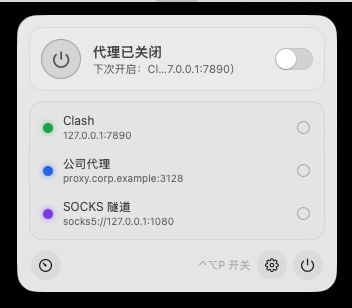
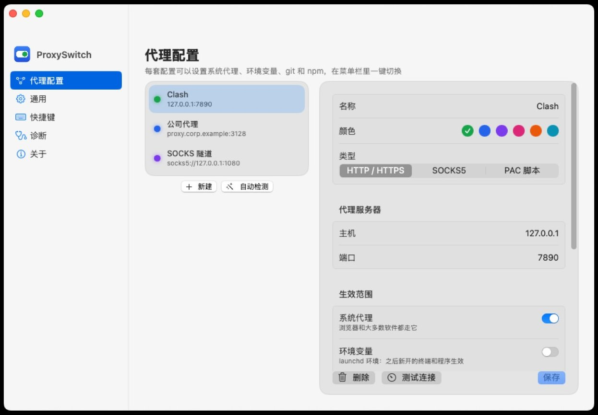

# ProxySwitch for Mac

macOS 菜单栏里的代理开关：一键切换系统代理、环境变量、git 和 npm 的代理设置，多套配置随时切换。原生 Swift 写成，界面是毛玻璃风格，在 macOS 26 上会用系统的 Liquid Glass。

Windows 版在 [proxyswitch](https://github.com/whrss9527/proxyswitch)，两边功能各自演进。

<p align="center"></p>
<p align="center"></p>

## 功能

- **菜单栏面板**：点图标弹出，大开关、配置列表和每个配置的延迟、复制在当前终端里用代理的命令、一键测速、进设置。右键或 Control + 点击是简洁菜单。
- **多套配置**：HTTP / SOCKS5 / PAC 三种。每套可以选生效范围：系统代理、环境变量、git、npm。
- **系统代理**：读取和监听用 SystemConfiguration，别的程序（Clash、Surge、公司脚本）改了代理会立刻反映在图标上，可以一键保存成配置。写入用 `networksetup`。
- **环境变量**：写到 launchd（`launchctl setenv`），之后新开的终端和程序都能读到；已经打开的终端用面板里复制的 `export` 命令。
- **测速与健康检查**：经代理实际访问测速地址测延迟（PAC 由系统执行，和浏览器一致）；开启期间定期检查代理端口，连不上时提醒。
- **自动检测**：找出本机正在运行的代理软件监听的端口，确认能用后一键添加。
- **全局快捷键**：默认 ⌃⌥P 开关代理，可以在设置里录制新的。
- **登录时启动**：系统设置的「登录项」里可以看到和关闭。
- **命令**：`open proxyswitch://toggle`、`proxyswitch://on`、`proxyswitch://off`、`proxyswitch://use?name=配置名`、`proxyswitch://settings`、`proxyswitch://update`，可以接快捷指令和脚本。
- **检查更新与一键更新**：启动后和每 6 小时检查一次 GitHub 上的新版本（可以关掉），有新版本时通知、面板里出现更新条。点「更新」会下载 zip、比对 SHA-256、就地替换 `ProxySwitch.app` 并自动重新启动；装在「应用程序」里的标准账户会弹一次系统授权对话框。

## 安装

1. 在 [Releases](../../releases) 下载 `ProxySwitch-macos.zip`，解压后把 `ProxySwitch.app` 拖到「应用程序」。
2. 程序没有 Apple 开发者签名，第一次打开会被系统拦下：在 `ProxySwitch.app` 上右键 → 打开 → 再点「打开」；或者在终端运行 `xattr -dr com.apple.quarantine /Applications/ProxySwitch.app`。
3. 需要 macOS 14 或更新版本。
4. 之后的版本在程序里更新：有新版本时面板里会出现更新条，点「更新」就行；也可以在「关于」页手动检查。请把程序放在「应用程序」里再更新，直接在下载文件夹里打开的程序被系统放在只读的临时位置，没法就地替换。

## 权限说明

- 修改系统代理需要**管理员账户**。标准账户会弹出系统的授权对话框，输入一次管理员密码。
- 全局快捷键用 Carbon 的热键接口，不需要辅助功能权限。
- 通知需要在第一次弹出时允许。

## 文件位置

配置、状态和日志都在 `~/Library/Application Support/ProxySwitch/`：`config.json`、`state.json`、`proxyswitch.log`。诊断页里可以直接打开这个目录。

## 开发

需要 Xcode 16 或更新版本（用 Xcode 26 编译才有 Liquid Glass）。

```bash
swift build                          # 编译
swift test                           # 单元测试（纯逻辑：命令生成、状态解析、配置读写……）
VERSION=0.1.0 Scripts/build-app.sh   # 组装通用二进制的 dist/ProxySwitch.app 和 zip，ad-hoc 签名
```

代码结构：

| 目录 | 内容 |
| --- | --- |
| `Sources/ProxySwitch/App` | 入口、`AppState`（配置、状态、开关逻辑） |
| `Sources/ProxySwitch/Models` | 配置、系统代理快照、networksetup 命令的生成 |
| `Sources/ProxySwitch/System` | 系统代理、环境变量、git / npm、测速、快捷键、登录项、通知、URL 命令 |
| `Sources/ProxySwitch/UI` | 菜单栏图标与面板、设置窗口各页、毛玻璃样式、快捷键录制 |
| `Tests` | XCTest |
| `Scripts/build-app.sh` | 组装 .app、签名、打 zip |
| `Resources` | Info.plist、图标 |

推送代码时 GitHub Actions 会在 macOS 上编译、测试、打包并启动一次截图，然后用本地 HTTP 服务器假装发布一个 9.9.9 版本，走一遍下载、校验、替换、重新启动的完整更新流程；推送 `v*` 标签会自动打包并发布 Release。

本机调试更新流程时可以把环境变量 `PROXYSWITCH_UPDATE_URL` 指向一个返回 GitHub releases 格式 JSON 的地址（见 `.github/workflows/ci.yml` 里的做法）。

## 许可证

[MIT](LICENSE)
